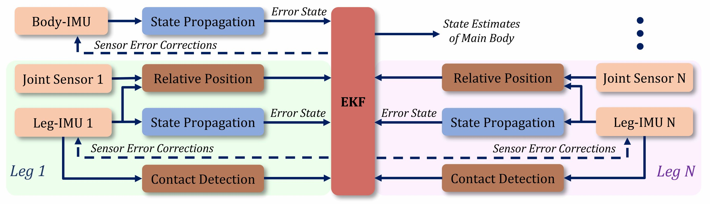
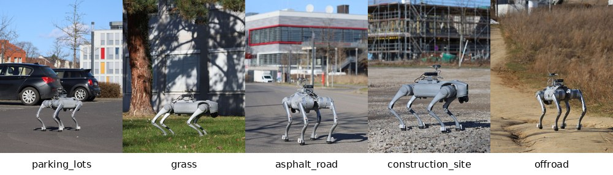

# DogLegs

**Robust proprioceptive state estimation for legged robots with multiple leg-mounted IMUs.**

[Paper (arXiv)](https://arxiv.org/abs/2503.04580) · [IEEE Xplore](https://ieeexplore.ieee.org/document/11246027) · [Dataset](https://drive.google.com/drive/folders/1wIB7fVQ7DWmxf8idoZhdczL5d7XPhJOk?usp=drive_link)

DogLegs estimates the main-body pose, velocity, and IMU errors from a body IMU, four leg IMUs, joint encoders. It is a **standalone C++17 program**: ROS is needed only to record the input bags, not to run the estimator.

Our [leg-odometry](https://github.com/YibinWu/leg-odometry) repository provides the baseline system. It uses a body IMU and joint encoders, without foot-mounted IMUs.

<p align="center">
  
</p>

## Quick start

Requirements: Linux, CMake 3.10+, and a C++17 compiler. Eigen, yaml-cpp, and Abseil are vendored under `ThirdParty/`.

Download the [datasets](https://drive.google.com/drive/folders/1wIB7fVQ7DWmxf8idoZhdczL5d7XPhJOk?usp=drive_link) into `datasets/`, then build and run a sequence:

```bash
cmake -S . -B build -DCMAKE_BUILD_TYPE=Release
cmake --build build -j
./build/DogLegs config/parking_lots.yaml
```

Available sequence configurations are `parking_lots`, `grass`, `asphalt_road`, `construction_site`, and `offroad`. Results are written to the config's `outputpath` (for example, `Body_traj.txt`, per-IMU trajectories, uncertainties, and update logs).

Plot an estimated trajectory with optional ground truth:

```bash
python3 utils/plot.py output/parking_lots
```

## Input bag format

DogLegs reads **uncompressed ROS1 v2 bags** with one body-IMU topic, four leg-IMU topics, and the robot-sensor topic:

```text
/doglegs/imu/body, /doglegs/imu/fl, /doglegs/imu/fr,
/doglegs/imu/rl,   /doglegs/imu/rr, sensor_msgs/Imu,
/doglegs/robot_sensor
```

Each IMU message provides angular velocity and linear acceleration. `robot_sensor` contains 29 values: timestamp, 12 joint positions, 12 joint velocities, and 4 foot forces. Sensor noise, IMU-to-foot lever arms, mounting angles, coordinate conversion, and robot geometry are configured in the YAML files under `config/`.

## Field sequences

<p align="center">
  
</p>

## Citation

```bibtex
@inproceedings{wu2025doglegs,
  title     = {DogLegs: Robust Proprioceptive State Estimation for Legged Robots Using Multiple Leg-Mounted IMUs},
  author    = {Wu, Yibin and Kuang, Jian and Khorshidi, Shahram and Niu, Xiaoji and Klingbeil, Lasse and Bennewitz, Maren and Kuhlmann, Heiner},
  booktitle = {IEEE/RSJ International Conference on Intelligent Robots and Systems (IROS)},
  year      = {2025}
}
```

## Contact

Dr. Yibin Wu — `yibin.wu@igg.uni-bonn.de`
