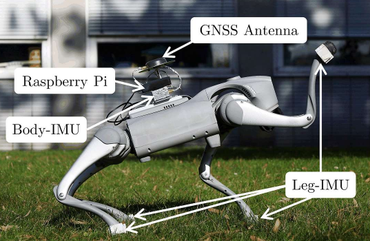

# [IROS 2025] DogLegs: Robust Proprioceptive State Estimation for Legged Robots Using Multiple Leg-Mounted IMUs

<p align="left">
  <a href="https://ieeexplore.ieee.org/document/11246027"></a>
  <a href="https://github.com/V1ctorzyc/DogLegs"></a>
  <a href="https://www.ros.org/"></a>
</p>

Robust proprioceptive state estimation for legged robots using a body-mounted
IMU, four leg-mounted IMUs, joint encoders, and contact-aware constraints.
DogLegs uses an error-state EKF to estimate the robot body state and does not
require a ROS installation at runtime.

Authors: Yibin Wu, Jian Kuang, Shahram Khorshidi, Xiaoji Niu, Lasse Klingbeil,
Maren Bennewitz, and Heiner Kuhlmann.


<p align="center">
  
</p>

## Method

This is our implementation to estimate the state of the legged robot's main body with a body mounted IMU and the joint encoders [[1](#2-reference), [2](#2-reference)]. We use the rosbag collected from an [unitree go2](https://github.com/unitreerobotics/unitree_ros2) robot. 


## Repository Structure

```text
DogLegs/
├── config/        Example and sequence configurations
├── datasets/      ROS1 bags and optional ground-truth files
├── src/           Estimator, EKF, and bag reader
├── ThirdParty/    Vendored C++ dependencies
├── utils/         Trajectory plotting
└── figure.png     Overview figure
```

Runtime results are written to the `outputpath` specified in each config.

## Build and Run

Requirements: Linux, CMake >= 3.10, and a C++17 compiler. Eigen, yaml-cpp, and
Abseil are included under `ThirdParty/`.

```bash
cmake -S . -B build -DCMAKE_BUILD_TYPE=Release
cmake --build build -j
./build/DogLegs config/example.yaml
```

Sequence configs are provided for `parking_lots`, `grass`, `asphalt_road`,
`construction_site`, and `offroad`.

## Data Format

The executable reads an uncompressed ROS1 bag with these topics:

```text
/doglegs/imu/body       sensor_msgs/Imu
/doglegs/imu/fl         sensor_msgs/Imu
/doglegs/imu/fr         sensor_msgs/Imu
/doglegs/imu/rl         sensor_msgs/Imu
/doglegs/imu/rr         sensor_msgs/Imu
/doglegs/robot_sensor   std_msgs/Float64MultiArray
```

IMU samples use `angular_velocity` and `linear_acceleration`. The robot sensor
array contains 29 doubles in this order:

```text
timestamp, 12 joint positions, 12 joint velocities, 4 foot forces
```


## Plot

Plot a result:

```bash
python3 utils/plot.py output/parking_lots
```

The script  uses `datasets/gt/gt_tum_<name>.txt` when it exists.
Sequences without a matching file, such as `grass`, are plotted with the
estimator output only. Add `--save <image>` to save the figure instead of
opening a window.


## Contact

`yibin.wu@igg.uni-bonn.de`

## Reference
[1] M. Bloesch, M. Hutter, M. A. Hoepflinger, S. Leutenegger, C. Gehring, C. D. Remy, and R. Siegwart, “State estimation for legged robots: Consistent fusion of leg kinematics and IMU,” in Proc. Robot.: Sci. Syst., pp. 17–24, 2013.

[2] M. Bloesch, C. Gehring, P. Fankhauser, M. Hutter, M. A. Hoepflinger, and R. Siegwart, “State estimation for legged robots on unstable and slippery terrain,” in Proc. IEEE/RSJ Int. Conf. Intell. Robots Syst., pp. 6058–6064, 2013.